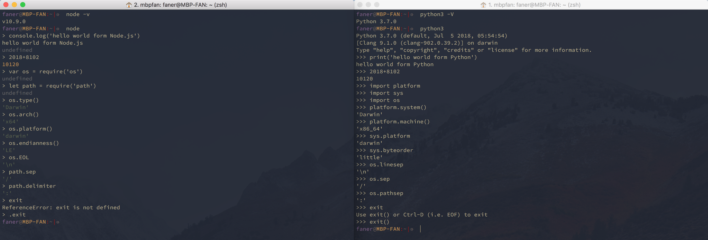
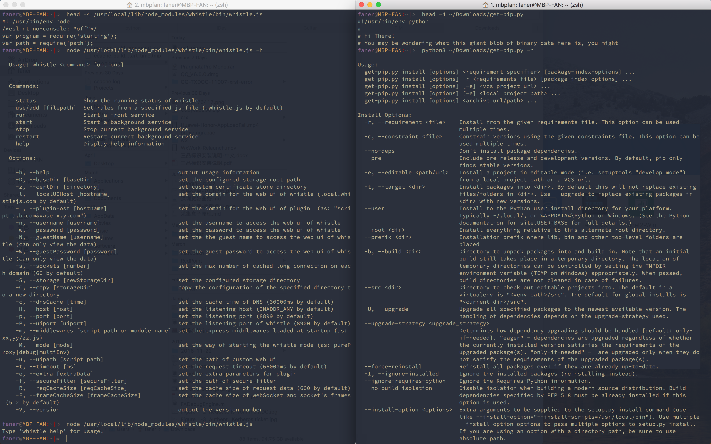

## 关于 Node.js

Node.js 是一个基于 Chrome [V8](https://developers.google.com/v8/) 引擎的 JavaScript 运行环境。

Node.js 将 JavaScript 脚本语言从浏览器的牢笼中解放出来，其提供的 node 运行环境使得我们可以像使用 python 等脚本语言一样基于 JavaScript 编写构建 server-side 应用程序。

## 安装 [Node.js](https://nodejs.org/)

在 macOS 终端中执行 `brew install node` 命令即可安装最新版 node。  

```shell
faner@MBP-FAN:~|⇒  node -v
v10.9.0
```

执行 `node -h` 可查看 Usage 帮助：

```shell
faner@MBP-FAN:~|⇒  node -h
Usage: node [options] [ -e script | script.js | - ] [arguments]
       node inspect script.js [arguments]

Options:
  -                          script read from stdin (default;
                             interactive mode if a tty)
  --                         indicate the end of node options
```

执行 `man node` 可查看 Manual 手册：

```shell
NODE(1)                   BSD General Commands Manual                  NODE(1)

NAME
     node -- server-side JavaScript runtime

SYNOPSIS
     node [options] [v8-options] [-e string | script.js | -] [--] [arguments ...]
     node debug [-e string | script.js | - | <host>:<port>] ...
     node [--v8-options]

DESCRIPTION
     Node.js is a set of libraries for JavaScript which allows it to be used outside
     of the browser.  It is primarily focused on creating simple, easy-to-build net-
     work clients and servers.
```

## node 交互

安装 node 后，在终端敲下 `node` 即进入 node 交互控制台。

bash shell 的前导符（primary prompt，PS1）为 <kbd>$</kbd>，python shell 前导符为3个大于号 `>>>`，node shell 的前导符则为一个大于号 <kbd>></kbd>，等待输入命令。  

```shell
faner@MBP-FAN:~|⇒  node
> console.log('hello world from Node.js')
hello world from Node.js
undefined
> exit
ReferenceError: exit is not defined
>
(To exit, press ^C again or type .exit)
> .exit
```

连按两次 `^C` 或输入 `.exit` 即可退出控制台。

### 与 python 对比

以下是 node 和 python 导入内置模块，然后获取打印系统相关信息的代码对照：



1. 脚本首行 [shebang](https://en.wikipedia.org/wiki/Shebang_(Unix))

	- python：`#!/usr/bin/env python`  
	- node js：`#! /usr/bin/env node`  

2. 脚本 Usage 帮助

	- python：`python get-pip.py -h`  
	- node：`node whistle.js -h`  

3. 脚本运行：

	- python：`python3 get-pip.py`  
	- node：`node whistle.js`  

> 脚本首行的 shebang 已经指定解释器，当脚本文件具有可执行权限（`x`）时，可省掉前面的解释器命令。



## NPM

Node.js 默认内置了模块管理工具 —— **NPM**（Node Package Manager）。  

```shell
faner@MBP-FAN:~|⇒  npm -v
6.4.0
```

执行 `npm -h` 可查看命令帮助。  
执行 `npm help install` 可查看子命令 install 的帮助。  

### cnpm

用 npm 安装淘宝 [cnpm](https://npm.taobao.org/)：

```shell
npm install cnpm -g --registry=https://registry.npm.taobao.org
```

执行 `cnpm -v` 查看版本信息：

```shell
faner@MBP-FAN:~|⇒  cnpm -v
cnpm@6.0.0 (/usr/local/lib/node_modules/cnpm/lib/parse_argv.js)
npm@6.2.0 (/usr/local/lib/node_modules/cnpm/node_modules/_npm@6.2.0@npm/lib/npm.js)
node@10.9.0 (/usr/local/Cellar/node/10.9.0/bin/node)
npminstall@3.10.0 (/usr/local/lib/node_modules/cnpm/node_modules/_npminstall@3.10.0@npminstall/lib/index.js)
prefix=/usr/local
darwin x64 17.7.0
registry=https://registry.npm.taobao.org
```

安装 whistle：

```shell
[c]npm install -g whistle
```
